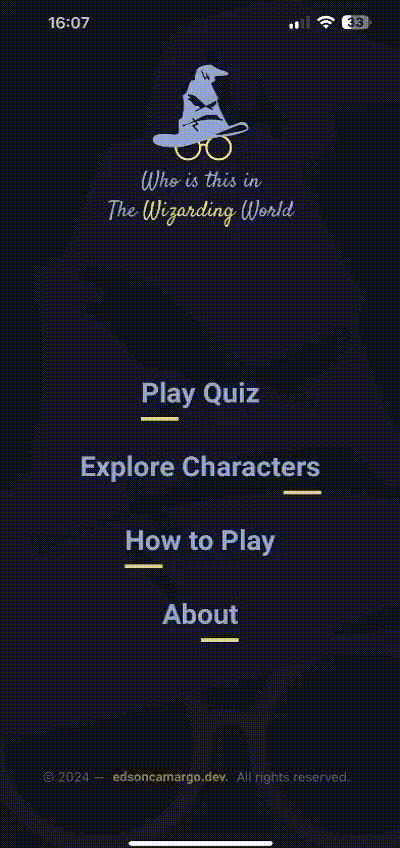

# Who is this in The Wizarding World


**Who is this in The Wizarding World** is a React Native app quiz that challenges you to identify characters from the Harry Potter universe based on their photos. With four possible names to choose from, test your knowledge and see if you can correctly guess the character's name. Character data is collected through web scraping, and the app's database is self-maintained.

## Status

This project is ongoing and has not yet been completed. Some features may be incomplete or in the development phase.

## Credits

The data about Harry Potter characters was collected from the website **harrypotter.fandom**, available at [https://harrypotter.fandom.com/pt-br/wiki].

## Technology

The following are the key technologies and tools used in the development of this project:

### Mobile

- **React Native**: It's a mobile app development framework that allows you to build native apps for iOS and Android using JavaScript and React. It enables mobile app development with a single codebase, providing a native user experience.
- **Expo**: It's an open-source platform and set of tools for building native mobile apps using JavaScript and React Native. Expo provides a range of ready-to-use components and APIs that streamline app development, including access to features like camera, geolocation, and push notifications.
- **Nativewind**: NativeWind uses Tailwind CSS as scripting language to create a universal style system for React Native. NativeWind components can be shared between platforms and will output their styles as CSS StyleSheet on web and StyleSheet.create for native.
- **Axios**: Is a simple promise based HTTP client for the browser and node.js. Axios provides a simple to use library in a small package with a very extensible interface.
- **Moti**: Is a declarative animations library for React Native that allows developers to create smooth and interactive animations with ease. It provides a simple API for defining animations using JavaScript syntax, making it straightforward to add motion to your app's UI elements.
- **React Native Reanimated**: I s a powerful animation library for React Native that provides a low-level API for building complex and high-performance animations. It allows developers to create fluid and responsive animations by directly manipulating the native animation drivers on the UI thread.

### Server

- **NodeJS**: Is a JavaScript runtime built on Chrome's V8 JavaScript engine.
- **Fastify**: Is a web framework highly focused on providing the best developer experience with the least overhead and a powerful plugin architecture.
- **Prisma**: Is a next-generation ORM that consists of these tools:

  - Prisma Client: Auto-generated and type-safe query builder for Node.js & TypeScript
  - Prisma Migrate: Declarative data modeling & migration system
  - Prisma Studio: GUI to view and edit data in your database

- **Zod**: Is a TypeScript-first schema declaration and validation library. I'm using the term "schema" to broadly refer to any data type, from a simple string to a complex nested object.
- **aws-sdk**: The AWS SDK is a toolkit for integrating applications with Amazon Web Services. Specifically, using the S3 service allows scalable and secure storage of character images.

## How It Works

### How to Play:

- The objective of the game is to correctly guess the character shown in the photo.
- Each round will present a random photo of a character from the Harry Potter universe, including humans, wizards, and creatures.
- Four answer options will be displayed, each with the name of a related character. Only one of the options is the correct answer.
- The player starts with three lives, represented by magical wands. Each incorrect answer or failure to respond within the time limit will result in the loss of a life.
- A 10-second timer will be displayed for each question. If the time runs out before answering, a life will be lost.
- The timer will reset for each new question.
- The number of characters to be guessed is determined by the current level. The game starts at Level 1 with 10 characters and progresses to Level 10, where an additional 10 characters are added with each level.
- There is no automatic level progression. The player wins the game by reaching the last question of the level without losing all three lives.
- If the player answers 5 questions correctly in a row, a strike is made, recovering one life. However, the maximum number of lives is 3.
- The game offers an "Explorer Characters" section where players can search and filter the characters for practice before playing the quiz.
- At the end, there is a scoreboard displaying statistics from the previous game, including errors, correct answers, and lives lost.

## Screenshots

### Mobile

#### Play Quiz


#### Explore Characters


#### How to Play



#### About


## Installation

To run the app locally, follow these steps:

Clone the repository:

```bash
git clone git@github.com:edsoncamargo/who-is-this-in-the-wizarding-world-app.git
cd your-path/who-is-this-in-the-wizarding-world-app
```

Next, follow the steps below:

### Mobile

1. Install the dependencies:

```bash
   cd mobile
   npm install
```

2. Start the web:

```bash
   npx expo start
```

3. Scan the QR code using the Expo Go app on your mobile device or use an emulator to test the app.

### Server

1. Install the dependencies:

```bash
   cd server
   npm install
```

2. Run the database migrations:

```
   npx prisma migrate dev
```

2. Start the server:

```bash
   npm run dev
```

## Contribution

You are welcome to contribute to the development of this project. If you find bugs, wish to add new features, or improve usability, feel free to open an issue or submit a pull request.

## Contact

- Name: Edson Camargo Menezes
- Email: contact@edsoncamargo.dev

## Acknowledgments

Special thanks to everyone who contributed to making this app a reality, including my girlfriend Malu, and JK Rowling for creating the world of Harry Potter.

Enjoy using **Who is this in The Wizarding World!**
